# SMART Platform Playbook

### Talent Verification Architecture, Standards & Build Reference

|                   |                                                                   |
| ----------------- | ----------------------------------------------------------------- |
| **Document type** | Engineering & Product Playbook                                    |
| **Status**        | Active reference — supersedes all prior flow/spec drafts          |
| **Owner**         | Platform Engineering                                              |
| **Scope**         | Full-stack reference for building, extending, and governing SMART |

---

## 1. Purpose

This playbook is the single reference for how SMART is built, verified, and scaled. It defines the product's non-negotiable principles, the standards that resolve every ambiguous design question raised during specification, the end-to-end flows, the data and service architecture, and the roadmap to the platform's target end-state.

It is written to be built from directly. Where a decision has been made, it is stated as a standard, not a suggestion. Where a decision genuinely belongs to business or legal rather than engineering, it is named explicitly in §12 rather than left ambiguous.

---

## 2. Product Principles

**2.1 Verification is the product.**
SMART does not compete on having an assessment engine or an interview tool — every serious competitor has those. SMART competes on the claim that every skill on a profile is backed by evidence that cannot be self-asserted into existence. Three failure modes define what the platform must resist:

- Anyone can claim any skill on a resume or profile.
- A matching engine built on unverified claims produces unverified matches — it does not matter how good the algorithm is if the input is fiction.
- Recruiter relationships and institutional memory churn constantly; verified, structured data does not.

Every module in this playbook exists to answer one question for a given skill claim: _is this backed by something that cannot be faked?_ Any feature that weakens that guarantee, even for the sake of onboarding speed or completion rate, is a regression, not a trade-off.

**2.2 Two distinct deployment models, one core engine.**
SMART has two end states running in parallel, and they must not be built as two products:

- **Embedded in academia** — SMART is the system of record a college's placement office runs on, verifying students against _external_ evidence (public repos, external employers, external platforms).
- **Embedded in companies** — SMART is installed inside a company as an internal tool run on its _own_ employees, verifying against evidence the company already owns (HRIS org charts, internal repos, internal review cycles).

The verification, trust-scoring, and assessment logic is identical in both cases. Only the evidence-source adapters differ. Section 7 formalizes this as a tenant-type split. If a future feature cannot be built without forking core logic between these two modes, that is a signal the tenant abstraction has been violated and needs to be fixed before the feature ships.

---

## 3. Actors

| Actor                             | Scope                                                                                                                                                              |
| --------------------------------- | ------------------------------------------------------------------------------------------------------------------------------------------------------------------ |
| **Super Admin**                   | Platform-wide provisioning, health, billing. No default access to tenant data (§9.4).                                                                              |
| **Institutional Admin**           | One academic tenant — roster, cohort dashboards, batch/training management, placement tools.                                                                       |
| **Enterprise Admin**              | One enterprise tenant — internal workforce onboarding via HRIS sync, internal mobility/readiness dashboards.                                                       |
| **Candidate (Academic)**          | Student building an externally verified profile for employment.                                                                                                    |
| **Candidate (Internal Employee)** | Employee building an internally verified profile for mobility or upskilling.                                                                                       |
| **Voucher**                       | External: manager, peer, founder, or CXO confirming via corporate email. Internal: manager confirming via native org-chart relationship, no domain check required. |
| **Employer / Recruiter**          | Consumes verified profiles via job matching — may or may not run their own enterprise tenant.                                                                      |
| **Integration Partner**           | HRIS, ATS, or LMS systems connected through the public API.                                                                                                        |

---

## 4. Tenant Model

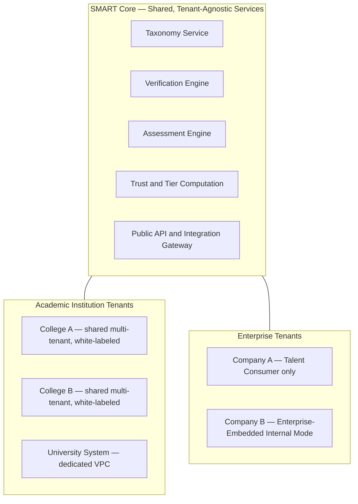

**Standard:** `TenantType` (`ACADEMIC_INSTITUTION` | `ENTERPRISE`) is a top-level field in the data model, set at provisioning and never inferred. Evidence-source adapters are selected per tenant type; the verification, trust, and assessment engines beneath them run identical code paths regardless of tenant type.

---

## 5. Core Flows

### 5.1 Provisioning

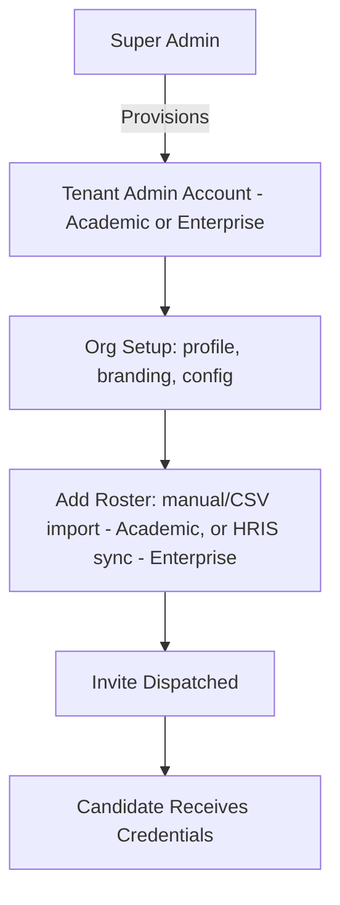

### 5.2 Candidate Onboarding & Skill Declaration

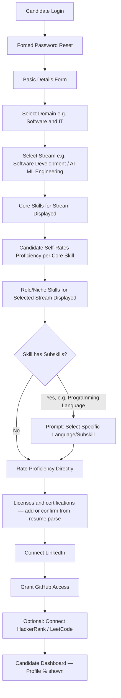

**Standard:** the Domain → Stream → Skill → Subskill taxonomy is admin-configurable, not hardcoded. Self-declared proficiency captured here is stored as `SELF_DECLARED` status and is never merged with verified status fields — the distinction between claimed and confirmed is the product's core asset and must remain queryable as such throughout the stack.

**Standard — Licenses & certifications:** the profile and resume-parse draft must carry a first-class `licenses` list (name, issuer, optional id / dates / url). This is not a skill claim and not a SMART certificate. Sathesh renders it on CN-T01/CN-T03; Ramansh extracts it on CN-T02.

### 5.3 Verification Pillar One — Work Experience

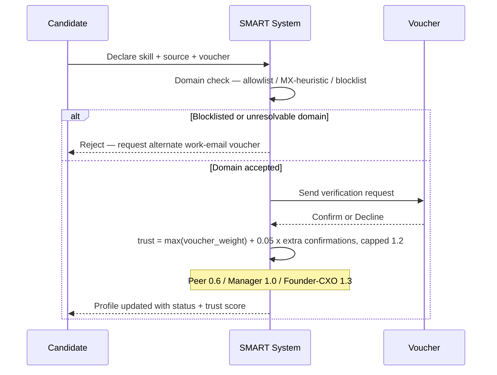

**Standard — Domain validation:** three tiers, applied in order: (1) a curated allowlist seeded from LinkedIn company data and institution-submitted employer lists, (2) a real-time MX-record and business-registration heuristic for unlisted domains, (3) a hard blocklist of free/personal providers, rejected before a request ever reaches a voucher. A paid domain-intelligence API is introduced only once verification volume makes the cost justified — it is not a launch dependency.

**Standard — Trust weighting:** Peer = 0.6, Reporting Manager = 1.0, Founder/CXO = 1.3. Multiple independent confirmations for the same skill take the maximum single weight plus 0.05 per additional confirmation, capped at 1.2. Averaging is explicitly disallowed as a scoring method, since it allows several low-trust vouchers to be stacked to simulate one high-trust confirmation.

**Standard — Enterprise mode variant:** internal vouching uses the native org chart pulled from HRIS. No domain-verification step is applied, since the employer already owns and trusts its own directory data.

### 5.4 Verification Pillar Two — Projects

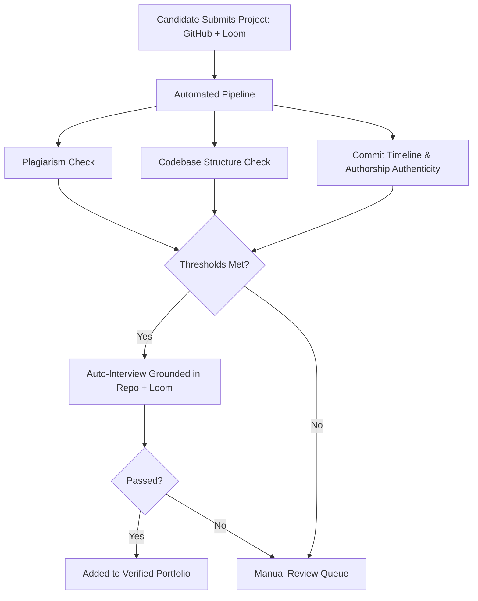

**Standard — Third verification metric:** Commit Timeline & Authorship Authenticity. This checks commit frequency and timestamps, and diff authorship, against the build process described in the Loom walkthrough, and flags single-commit-dump repositories or forks with near-zero original diff created shortly before submission. Plagiarism checks catch copied code; structure checks catch poor architecture; this metric is the one that catches a candidate submitting someone else's finished work as their own.

**Standard — Enterprise mode variant:** project evidence is drawn from internal repositories (GitHub Enterprise, GitLab, Confluence) rather than public GitHub.

### 5.5 Verification Pillar Three — Passive Signal

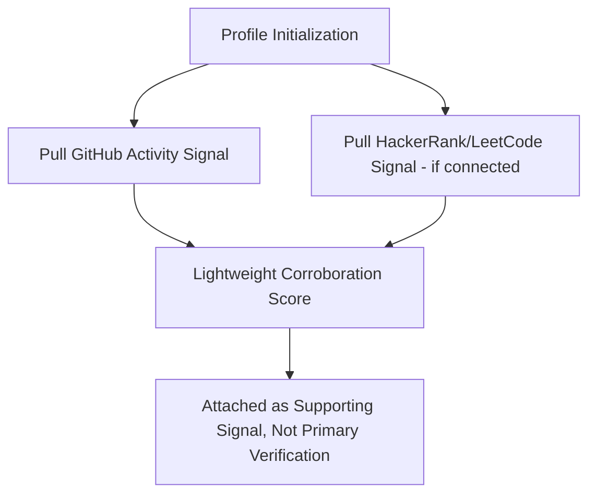

**Standard:** passive signal is corroborating weight only. It never independently promotes a skill's verification status and is stored separately in the data model from work-experience or project verification outcomes.

### 5.6 Assessment & Retry

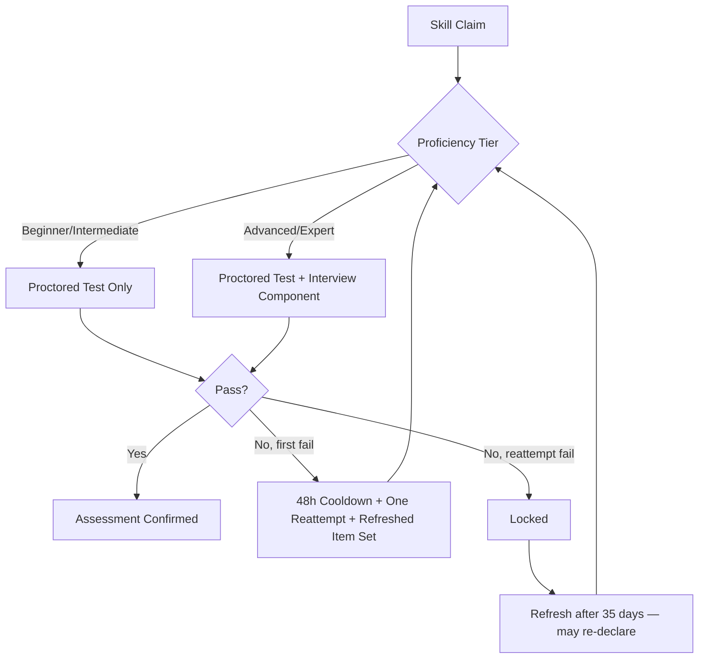

**Standard — Proficiency scale:** four tiers — Beginner, Intermediate, Advanced, Expert — applied uniformly across the taxonomy.

**Standard — Interview trigger:** the interview component activates only for Advanced and Expert claims. These carry the highest hiring stakes and the highest incentive to misrepresent; lower-tier claims are adequately gated by the proctored test alone.

**Standard — Retry policy (locked 1 Sep 2026):** one initial attempt and **one reattempt** (`SKILL_MAX_ATTEMPTS = 2` in `@smart/contracts`). 48 hours between those two attempts, refreshed items on the retry. After the reattempt fails the skill is `LOCKED`. The candidate may refresh / re-declare after **35 days** (`SKILL_REFRESH_DAYS`). Technical failures do not consume an attempt. Do not implement a third try or a 90-day rolling window.

### 5.7 Trust & Tier Computation

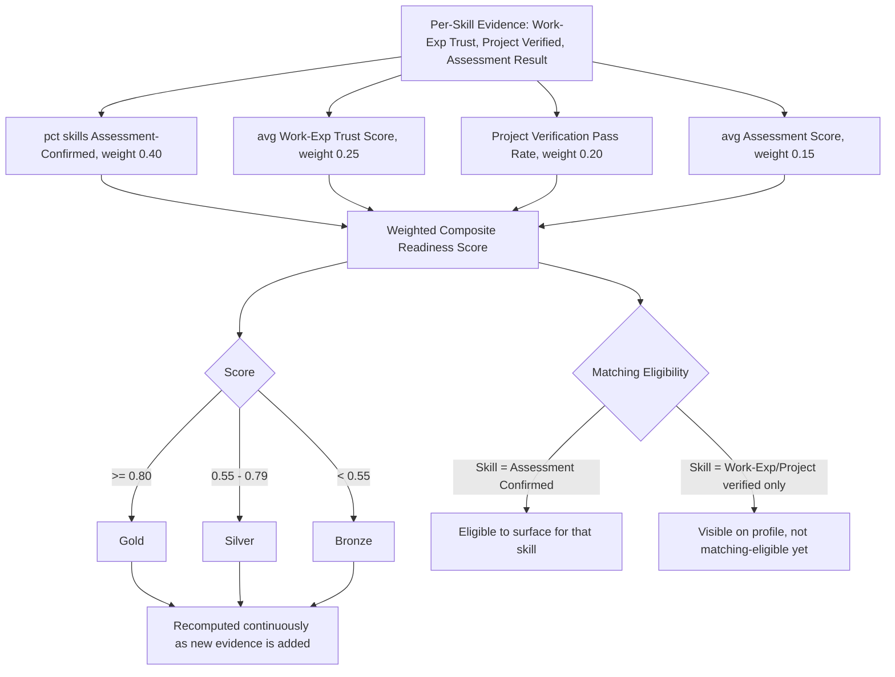

**Standard — Tier assignment:** Gold, Silver, and Bronze are derived outputs of the Readiness Score formula above, recomputed continuously as new evidence is added. Tiers are never assigned independently of the underlying verification data — a tier that could say more than the evidence supports would reintroduce the exact unverified-claim problem the platform exists to solve. The 0.80 / 0.55 cutoffs are configuration values, expected to be recalibrated once placement and mobility outcome data is available through ORION.

**Standard — Matching eligibility:** a skill must reach `ASSESSMENT_CONFIRMED` status to count toward job-matching eligibility. Work-experience or project verification alone enriches the profile and contributes to the Readiness Score, but does not make a skill matching-eligible. Matching is the highest-trust moment in the product — an employer acting on the match — and carries the platform's strictest evidence bar accordingly.

### 5.8 Enterprise-Embedded Mode

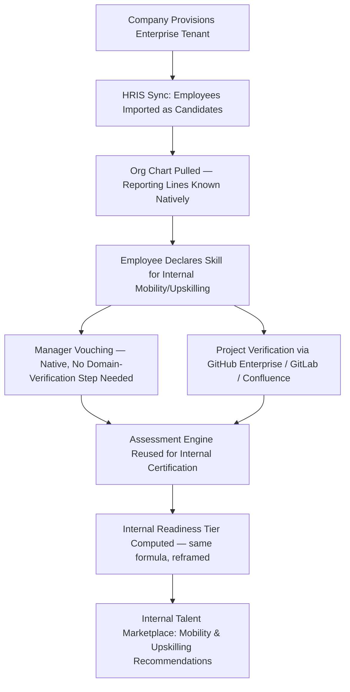

**Standard:** Enterprise-Embedded Mode reuses the verification, trust, and assessment engines from §5.3–5.7 without modification. Only the evidence-source adapters change — HRIS in place of an institution roster, native org chart in place of email-domain verification, internal repositories in place of public GitHub. Output framing shifts from external hire-readiness to internal mobility/upskilling readiness, but the underlying computation is identical.

### 5.9 Admin Dashboards

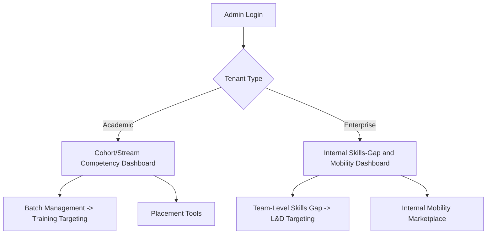

### 5.10 Job Matching (External)

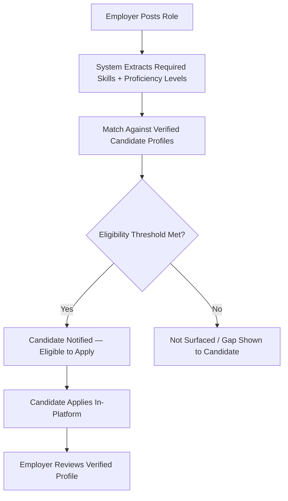

---

## 6. Candidate State Machine

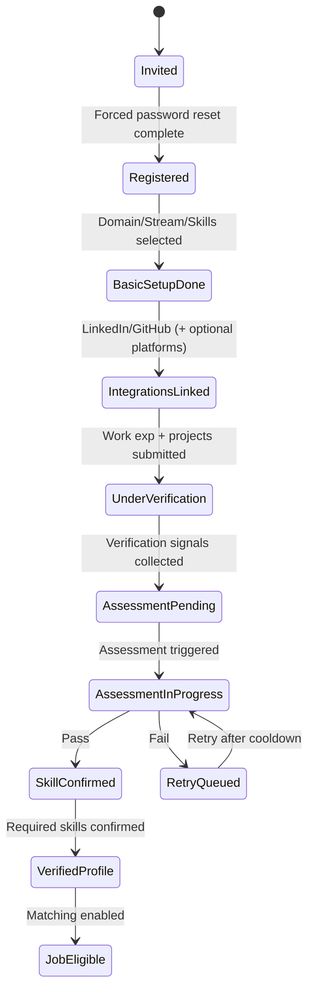

---

## 7. Data Model

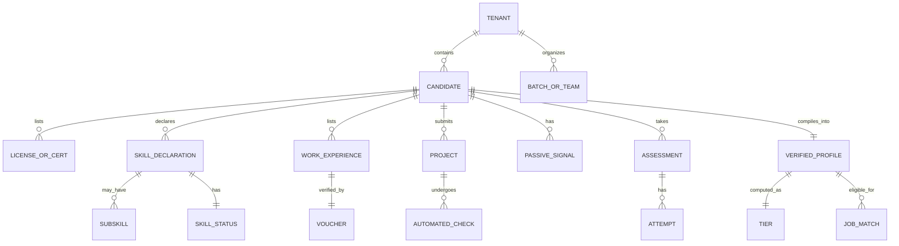

**Standard:** `SKILL_STATUS` is an explicit enum — `SELF_DECLARED → PENDING_VERIFICATION → WORK_EXP_VERIFIED → PROJECT_VERIFIED → ASSESSMENT_CONFIRMED` — read directly by every downstream consumer (dashboards, matching, tier computation). No consumer re-derives trust level from raw evidence independently; this is what prevents "verified" from meaning different things in different parts of the system.

**Standard — Isolation:** row-level `tenant_id` scoping with per-tenant encryption keys is the default for shared infrastructure. Dedicated-VPC tenants (§8) use physical isolation on the same codebase.

---

## 8. Deployment Tiers

| Tier                               | Applies to                                               | Isolation model                                   |
| ---------------------------------- | -------------------------------------------------------- | ------------------------------------------------- |
| Shared Multi-Tenant SaaS (default) | Most colleges, SMB/mid-market companies                  | Row-level security, tenant-scoped encryption keys |
| Dedicated VPC                      | Large enterprises, university systems, regulated sectors | Physically isolated deployment, shared codebase   |
| On-Prem / Self-Hosted Core         | Reserved for specific contractual requirements           | Not built speculatively — evaluated per deal      |

---

## 9. Compliance & Security Standards

**9.1 Data classification.** Candidate PII, proctoring recordings, voucher correspondence, and internal HRIS data are governed under distinct retention policies.

**9.2 Proctoring data retention.** Raw proctoring video and audio are purged automatically on a fixed schedule after scoring. Only the resulting score and flags are retained long-term.

**9.3 Consent.** Every integration — LinkedIn, GitHub, HackerRank, LeetCode, HRIS — requires explicit, independently revocable, per-scope consent.

**9.4 Super Admin access.** Super Admin accounts have provisioning, platform health, and billing visibility only. No default access to candidate PII, proctoring data, or tenant competency data is granted. Support access requires a time-boxed, audited break-glass elevation with tenant notification. This is documented as a standing security control, not an internal-only practice, and is included in enterprise security questionnaires.

**9.5 Regulatory sequencing.** DPDP Act (India) compliance is the near-term priority given the current academic market. GDPR-readiness follows for any EU-based users. SOC 2 Type II is pursued as the qualifying gate for larger enterprise and US-market sales.

---

## 10. Service Architecture

| Service                            | Responsibility                                                                |
| ---------------------------------- | ----------------------------------------------------------------------------- |
| Tenant Management                  | Tenant provisioning, `TenantType` configuration, isolation tier assignment    |
| Taxonomy Service                   | Domain/Stream/Skill/Subskill tree                                             |
| Verification Engine                | Work-exp, project, and passive-signal pipelines — tenant-agnostic core        |
| Academic Integration Adapter       | LinkedIn/GitHub/HackerRank/LeetCode OAuth, external email-domain verification |
| Enterprise Integration Adapter     | HRIS sync, internal org-chart ingestion, internal repository access           |
| Assessment Engine                  | Item generation, proctoring, scoring, retry/cooldown                          |
| Trust & Tier Computation           | Formula-driven, versioned, independently auditable scoring                    |
| Institutional/Enterprise Analytics | Cohort dashboards, internal skills-gap dashboards                             |
| Matching Service                   | External job matching and internal mobility marketplace                       |
| Public API & Integration Gateway   | HRIS/ATS/LMS partners, embeddable verified-profile widget                     |
| Compliance & Audit Service         | Break-glass access logging, consent management, retention enforcement         |
| Notification Service               | Invites, voucher requests, reminders                                          |

---

## 11. Roadmap

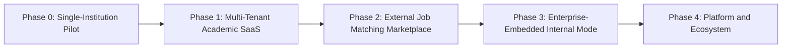

| Phase | Milestone                                                                                                  |
| ----- | ---------------------------------------------------------------------------------------------------------- |
| 0     | Single/few institution pilots, manual admin operations                                                     |
| 1     | Tenant isolation, self-serve institutional onboarding, white-labeling per college                          |
| 2     | Job matching live; employers onboard as lightweight consuming accounts                                     |
| 3     | Enterprise-Embedded Mode live; companies run SMART on their own workforce                                  |
| 4     | Public API, HRIS/ATS/LMS integration marketplace, dedicated-VPC option, embeddable verified-profile widget |

**Sequencing rule:** Phase 3 follows Phase 2, not the reverse. The verification and trust engine must be proven against external fraud incentives before it is trusted with internal enterprise use cases, where the failure mode shifts from external misrepresentation to internal politics around promotion-readiness scoring.

---

## 12. Items Requiring Business or Legal Decision

The following are explicitly out of engineering's authority to resolve and are tracked here rather than left ambiguous:

- Pricing and packaging across the three commercial surfaces — institution subscription, enterprise seat/internal-mode license, external job-matching transaction fee.
- Sequencing of compliance certifications (DPDP first vs. SOC 2 first) depending on which market is prioritized commercially over the next 12–18 months.
- Contractual data-residency commitments for specific large enterprise or university-system deals, to be negotiated per deal against the deployment tiers in §8.

---

## 13. Change Management

This playbook is versioned. Any change to a standard in §5 (trust weights, cutoffs, retry policy, matching eligibility bar) must be recorded with the prior value, the new value, and the data or incident that motivated the change — particularly once tier cutoffs and trust weights begin being recalibrated against real placement and mobility outcomes through ORION.

| Date       | Standard     | Prior                | New                                | Why                               |
| ---------- | ------------ | -------------------- | ---------------------------------- | --------------------------------- |
| 2026-09-01 | §5.6 retry   | 3 attempts / 90 days | 1 reattempt, 35-day refresh        | Allen — V1 ship lock              |
| 2026-09-01 | §5.2 profile | licenses omitted     | licenses & certifications required | Allen — missed on profile / parse |
