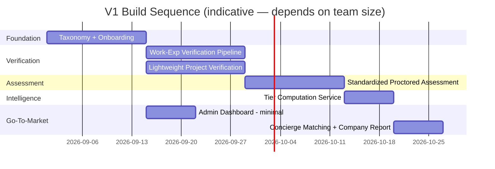
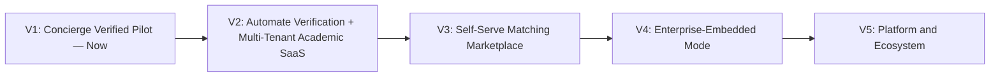

# SMART V1 — Launch Scope & Roadmap to Market

|                              |                                                                                                                                                                                                                              |
| ---------------------------- | ---------------------------------------------------------------------------------------------------------------------------------------------------------------------------------------------------------------------------- |
| **Document type**            | Product Roadmap — extends Playbook §11 (Roadmap), zooms into Phase 0                                                                                                                                                         |
| **Status**                   | Active reference                                                                                                                                                                                                             |
| **Relationship to Playbook** | Does not replace the architecture in the Playbook. Defines what ships first, what runs manually behind the scenes on purpose, and what triggers automation — so V1 can exist in weeks, not after the full platform is built. |

---

## 1. Objective

Get a credibly verified candidate pool in front of companies fast enough to secure design-partner hiring agreements, without waiting for the full verification, assessment, and matching automation described in the Playbook. Everything not load-bearing for that goal is deferred.

---

## 2. What "Adequate Verified Data" Means Before Approaching Companies

A demo with 20 shallow profiles will not survive a company's first follow-up question. The bar to clear before outreach starts:

- **150–300 candidates concentrated in 2–3 skill clusters**, not spread across every domain — e.g., "Software Development: React/Node" and "AI/ML Engineering: Python fundamentals." Companies respond to depth in a role they are actually hiring for, not shallow breadth.
- **Every profile shown to a company has at least one `ASSESSMENT_CONFIRMED` skill** (the Playbook's matching-eligibility bar applies here too — do not relax it for the sake of a bigger-looking pool) plus at least one additional verified signal (work experience or project).
- **A visible tier spread, not an all-Gold cohort.** A pool where nearly everyone is Gold reads as ungated and undermines the pitch. Some Silver and Bronze candidates in the shown set is evidence the tiering is real.
- **One or two source institutions with guaranteed follow-through**, not ten institutions with partial participation. Voucher response rate and assessment completion rate are the two numbers that will make or break the first company conversation — concentrate effort where you can guarantee both.

---

## 3. V1 Scope: Build, Defer, or Simulate

| Feature                                                                         | V1 Status                    | Notes                                                                                                                                                              |
| ------------------------------------------------------------------------------- | ---------------------------- | ------------------------------------------------------------------------------------------------------------------------------------------------------------------ |
| Taxonomy (Domain/Stream/Skill/Subskill)                                         | **Build — narrow**           | 2–3 streams only, not the full tree                                                                                                                                |
| Candidate onboarding & self-declaration                                         | **Build — full**             | Includes licenses & certifications (not optional chrome)                                                                                                           |
| GitHub connect                                                                  | **Build**                    | Required — feeds project verification                                                                                                                              |
| LinkedIn connect                                                                | **Build**                    | Optional at signup                                                                                                                                                 |
| HackerRank/LeetCode integration                                                 | **Defer**                    | Passive signal only; adds no trust story on its own                                                                                                                |
| Work-experience verification (voucher flow)                                     | **Build — full**             | Highest trust-per-engineering-hour in the whole platform. Ship this first and completely.                                                                          |
| Project verification: GitHub + Loom, plagiarism check, structure check          | **Build — basic automation** | The two cheaper automated checks; skip the third for now                                                                                                           |
| Commit-authenticity check + auto-interview                                      | **Simulate manually**        | A human reviewer runs a short async review in place of the automated auto-interview. Automate in V1.1 once the rubric has been run by hand enough times to encode. |
| Assessment engine: hyper-personalized item generation                           | **Defer**                    | Ship a standardized proctored test per skill/subskill instead — real proctoring, not yet per-candidate item generation                                             |
| Retry/cooldown logic                                                            | **Build — simple version**   | 48h between attempts, **1 reattempt**, **35-day** refresh (`@smart/contracts` v0.2.1)                                                                              |
| Trust & Tier computation (Gold/Silver/Bronze)                                   | **Build**                    | Cheap — it's a formula over data you already have, and it is the literal artifact you hand a company                                                               |
| Institutional admin dashboard                                                   | **Build — minimal**          | Roster + completion status only; cohort analytics deferred                                                                                                         |
| Matching engine (self-serve, real-time)                                         | **Defer — run as concierge** | Ops team runs the match query by hand and delivers a curated shortlist per company request                                                                         |
| Multi-tenancy, white-label, Enterprise mode, HRIS, compliance certs, public API | **Fully deferred**           | Playbook §11 Phases 1–4                                                                                                                                            |

---

## 4. Build Sequence

Dependency order, not priority order — each step unblocks the next:

1. **Taxonomy + candidate onboarding.** Skill declarations **and** licenses/certs. Everything downstream depends on these existing.
2. **Work-experience verification pipeline.** Fastest path from zero to a real, human-backed trust signal.
3. **Lightweight project verification.** Plagiarism + structure checks automated; interview step run manually.
4. **Standardized proctored assessment.** Integrate a third-party proctoring provider rather than building proctoring in-house — this is not a differentiating capability worth months of build time at V1.
5. **Tier computation service.** Pure formula layer once `SKILL_STATUS` exists — fast to build, disproportionately valuable to the pitch.
6. **Institutional admin roster + completion dashboard.** Minimal — enough to run the pilot cohort, not enough to sell as a standalone product yet.
7. **Concierge matching + company-facing report.** The actual deliverable — see §6.

---

## 5. What Stays Manual on Purpose

This is a deliberate concierge layer, not corner-cutting:

- **Project auto-interview** → human reviewer, short async video review against a fixed rubric.
- **Matching** → ops-run query, curated shortlist delivered directly — not a self-serve employer portal.
- **Institution onboarding** → white-glove setup, not self-serve signup.

**Automation trigger rule:** a manual step gets automated only after it has been run by hand successfully enough times to know exactly what the automation needs to encode — not before. A concrete bar: automate the project-review step once it has been run manually on at least 100 projects, and automate matching once concurrent company requests exceed roughly 5 at a time. Automating earlier means guessing at a rubric instead of encoding a proven one.

---

## 6. The Company-Facing Deliverable

What actually gets handed to a company from V1 is not API access — it's a **Verified Talent Snapshot**: a report or shared view, built per requested role, listing for each candidate:

- Tier (Gold/Silver/Bronze)
- Verified skills, each tagged with its verification type (work-experience / project / assessment-confirmed)
- Proficiency level
- A one-line verification trail — e.g., "Confirmed by Engineering Manager at [Company] + passed proctored assessment"

This is the artifact that makes the pitch land: not "we have an assessment platform," but "here is exactly why you can trust this list, line by line."

---

## 7. Success Metrics to Exit V1

- Number of design-partner companies actively engaged with at least one open role
- Percentage of shortlisted candidates reaching a first interview
- Voucher response rate — this is the leading indicator for whether the trust chain works at all before scaling it
- Assessment completion and pass rates within the pilot cohort

If voucher response rate or assessment completion is weak, that is a signal to fix before automating anything in §5 — automating a broken manual process just breaks it faster.

---

## 8. Risks of the Concierge Approach

- **Doesn't scale past a handful of companies without automation.** The triggers in §5 exist specifically so this is a planned transition, not a crisis.
- **Manual project review introduces reviewer inconsistency.** Mitigate with a written rubric from day one, even though the review itself is manual — this is also what the eventual automated check will be built from.
- **Voucher email deliverability.** Use a dedicated sending domain and monitor bounce/spam rates from the first cohort — a trust chain that gets marked as spam never reaches the voucher at all.

---

## 9. How V1 Maps to the Longer Roadmap

V1 corresponds to Playbook Phase 0, scoped down further with an explicit concierge layer. V2 onward follows the Playbook's existing Phase 1–4 sequence unchanged — this document does not alter that architecture, it defines the fastest responsible path into it.

---

## 10. Who owns what this week (tight cut)

Playbook services map to **existing owners**. Do not open a second ticket for the same outcome. Finish the journey, not the card.

| Outcome (playbook / this doc)   | Owner             | Zoho now               | Do not                                    |
| ------------------------------- | ----------------- | ---------------------- | ----------------------------------------- |
| Taxonomy + pass bars            | Vedika + Ramansh  | INF-05, INF-06         | Second skill table without linking claims |
| Onboarding wizard + profile     | Sathesh           | CN-T01, CN-T03, CN-T04 | 5k-line stacked PRs                       |
| Resume parse + licenses extract | Ramansh           | **CN-T02** (Th6-I102)  | A fake `S3-RM-05` card                    |
| Skill SM (1 reattempt / 35d)    | VB + Ramansh      | SE-T01                 | Hardcode 3 strikes or 60/180 days         |
| Bulk roster                     | Vishal Bharath    | AC-T02                 | Auto-send invites on upload               |
| Super Admin CRUD / flags        | Vishal V          | SA-T01–T04, T07        | Feature flags in `if (plan)`              |
| Rules match + notify            | Vishal V          | SE-T05, SE-T07         | Cosine as P0                              |
| JD / ATS / cert verify          | VB + Sathesh      | CO-T01, CO-T02, CN-T06 | Fifth company app                         |
| AI interview + proctoring-lite  | Ramansh + Sathesh | SE-T02, SE-T06         | Full liveness vendor this week            |
| Contracts, CI, promote          | Tino              | review / merge         | Feature code                              |

Prisma `skills.cooldown_days` / `validity_days` still default 60 / 180. **Vishal V:** one follow-up migration to 35 / 35. Until then SE-T01 reads `SKILL_REFRESH_DAYS` from contracts, not the column default.
