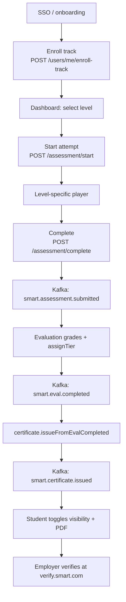
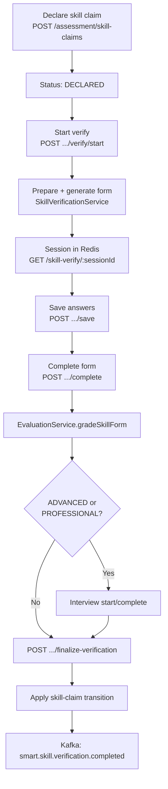
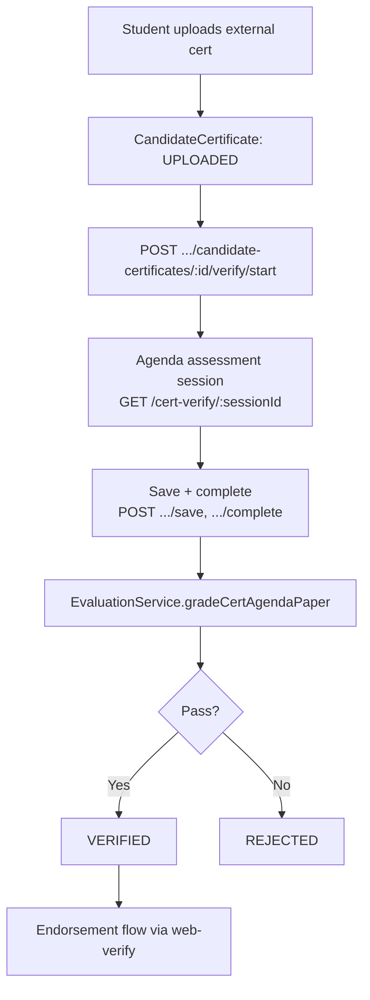

# Assessment & Skill Verification Flow

> **Scope:** End-to-end flows for track certification (L1–L5), per-skill verification (SDE v4), external certificate verification, scoring, certificate issuance, and public verification.
>
> **Sources:** `ARCHITECTURE.md`, `docs/Smart-Level-Tier.md`, `packages/contracts`, `packages/scoring-engine`, `apps/api-core`, `apps/web-student`, `apps/web-verify`.

---

## 1. Overview — Three Verification Paths

SMART runs three related but distinct verification systems:

| Path                                | What it certifies                               | Primary outcome                                                 |
| ----------------------------------- | ----------------------------------------------- | --------------------------------------------------------------- |
| **Track L1–L5**                     | Role readiness for a specialization track       | Platform `Certificate` with Tier Trail (Gold / Silver / Bronze) |
| **Skill claims (SDE v4)**           | Individual catalog skills at proficiency levels | `SkillClaim` → `VERIFIED` (BEGINNER → PROFESSIONAL)             |
| **External candidate certificates** | Third-party certs (AWS, Coursera, etc.)         | `CandidateCertificate` → `VERIFIED` via agenda assessment       |

All three share infrastructure (Redis sessions, evaluation module, ai-gateway for LLM grading) but have separate state machines, APIs, and outcomes.

---

## 2. Certification Model — Level × Tier

### 2.1 Two axes

- **Level (L1–L5)** = cognitive depth / assessment format — _what kind of thinking was tested_.
- **Tier (Gold / Silver / Bronze)** = performance quality within that level, relative to calibrated Angoff cut scores.

Canonical definitions live in:

- `packages/contracts/src/domain/levels.ts` — `LEVEL_DEFINITIONS`, `L5_SPLIT_WEIGHTS`, `LEVEL_UNLOCK_MIN_TIER`
- `packages/contracts/src/domain/enums.ts` — `TIERS`, `TIER_LABEL`, `TIER_RANK`
- `docs/Smart-Level-Tier.md` — product rationale and scoring mechanics

### 2.2 Level grid

| Level  | Name                            | Format       | Measures                                          | Scoring mode |
| ------ | ------------------------------- | ------------ | ------------------------------------------------- | ------------ |
| **L1** | Foundation Knowledge            | `MCQ`        | Recall / foundational understanding               | Synchronous  |
| **L2** | Applied Execution               | `SANDBOX`    | Apply concepts in sandboxed code/SQL/scenario     | Asynchronous |
| **L3** | Communication & Domain Judgment | `AUDIO_BARS` | Spoken articulation, trade-offs, domain reasoning | Asynchronous |
| **L4** | Verification Defense            | `DEFENSE`    | Defend submitted work under follow-up questioning | Asynchronous |
| **L5** | Capstone Project                | `CAPSTONE`   | End-to-end deliverable across domains             | Asynchronous |

### 2.3 Tier semantics

| Tier             | Label                       | Meaning                                  |
| ---------------- | --------------------------- | ---------------------------------------- |
| **GOLD**         | Ready Now                   | At or above the "ready now" Angoff cut   |
| **SILVER**       | Needs Supervised Onboarding | Solid but needs ramp-up                  |
| **BRONZE**       | Core Knowledge Present      | Minimum certifiable bar                  |
| **BELOW_BRONZE** | Not Yet Certified           | Internal only — gap report, never public |

### 2.4 Progression rule

The next level unlocks only when the prior level is cleared at **Bronze or above** (`LEVEL_UNLOCK_MIN_TIER`). Enforced in `AssessmentService.startAttempt()`.

### 2.5 Certificate model ("current standing")

One live certificate **per track** showing:

- `highestLevelCleared` — headline level on the certificate
- `headlineTier` — tier at that level
- `tierTrail` JSON — e.g. `{ "L1": "GOLD", "L2": "SILVER", "L3": "BRONZE" }`

Schema: `Certificate` in `apps/api-core/prisma/schema.prisma`. DTOs: `packages/contracts/src/dto/certificate.dto.ts`.

---

## 3. Track Certification Flow (L1–L5)

### 3.1 High-level sequence



### 3.2 Step-by-step journey

#### Step 1 — Auth & onboarding

- Google / GitHub OAuth; institutional SAML for campus SSO.
- UI: `apps/web-student/src/components/onboarding/OnboardingWizard.tsx`
- Onboarding captures **interest domain** (e.g. CS/IT, Business) — this is _not_ track enrollment.

#### Step 2 — Track enrollment

- `POST /users/me/enroll-track`
- Track registry: `packages/contracts/src/domain/tracks.ts` — 10 V1 tracks (5 IT + 5 MBA).
- Each track has 5 competency domains (A–E), a communication domain for L3/L4 rubrics, and a capstone brief for L5.

#### Step 3 — Start attempt

- `POST /assessment/start` → `AssessmentService.startAttempt()`
- Creates `Attempt` row with status `IN_PROGRESS`
- Validates level gating (prior level cleared at Bronze+)
- Parallel form rotation via item rotation service
- Redis session: `session:assessment:{attemptId}` (2h TTL)
- Emits `smart.assessment.started`

#### Step 4 — Take assessment (level-specific)

| Level  | API surface                                                         | UI / behaviour                                                              |
| ------ | ------------------------------------------------------------------- | --------------------------------------------------------------------------- |
| **L1** | `GET .../next-item`, `POST /assessment/submit-l1`                   | MCQ / numeric entry player; server-authoritative timer; Redis answer drafts |
| **L2** | `POST /assessment/compile-l2`, `GET /assessment/sandbox/:jobId`     | Code/SQL workspace; Docker sandbox via BullMQ; poll job status              |
| **L3** | `POST /assessment/l3/upload-url`, `POST /assessment/evaluate-l3-l4` | MediaRecorder → presigned R2 upload; async BARS grading                     |
| **L4** | `POST /assessment/evaluate-l3-l4`                                   | Multi-turn defense chat; AI gateway `P1_REALTIME` priority                  |
| **L5** | Capstone upload routes                                              | File/repo URL + checklist + presentation; 5–7 day window                    |

Session resume: `GET /assessment/:attemptId/session`

#### Step 5 — Proctoring (high-stakes levels)

- UI: `apps/web-student/src/components/proctoring/`
- API: `/proctoring/:attemptId/*` (nonce, violations, snapshot, ping)
- Integrity flags feed into certificate issuance gate (see §7).

#### Step 6 — Complete attempt

- `POST /assessment/complete` → `AssessmentService.completeAttempt()`
- Scores L1 responses synchronously (weighted item-response)
- Updates attempt → `EVALUATED` (or `SUBMITTED` / `EVALUATING` for async levels)
- Enqueues `smart.assessment.submitted` via `KafkaOutboxService.enqueueAssessmentSubmitted()`
- Invalidates Redis session `session:assessment:{attemptId}`

#### Step 7 — Grading pipeline

See §6 for full scoring detail. Summary:

1. Evaluation consumes `smart.assessment.submitted`
2. Per-response grading queued via `smart.eval.requested` → ai-gateway
3. `assignTier()` in `packages/scoring-engine` assigns Gold/Silver/Bronze
4. Publishes `smart.eval.completed`

Consumers:

- `evaluation/assessment-submitted-eval.consumer.ts`
- `certificate/eval-completed.consumer.ts` → `CertificateService.issueFromEvalCompleted()`

#### Step 8 — Certificate issuance

- Upserts `Certificate`, merges tier into `tierTrail`
- Sets `highestLevelCleared`, `headlineTier`, `status: ISSUED`, `verificationSlug`
- Emits `smart.certificate.issued` with `verificationUrl`

#### Step 9 — Student controls visibility

- `GET /certificates/mine` — list own certificates
- `PATCH /certificates/:certificateId/visibility` — student-controlled public toggle
- `GET /certificates/:certificateId/pdf` — signed R2 PDF URL

#### Step 10 — Public verification

- `GET /verify/:certificateId` — PUBLIC, no auth (20 req/min/IP)
- UI: `apps/web-verify/src/app/cert/[id]/page.tsx`
- Cached in Redis: `verify:cert:{certificateId}` (1h TTL)

---

## 4. Skill Verification Flow (SDE v4)

Per-skill verification certifies individual catalog skills at one of four proficiency levels. This is **separate from** track L1–L5 certification.

### 4.1 Proficiency levels

Defined in `packages/contracts/src/domain/skill-levels.ts`:

| Level            | Pass mark | Time   | Questions                        | Interview | Project |
| ---------------- | --------- | ------ | -------------------------------- | --------- | ------- |
| **BEGINNER**     | 60%       | 30 min | 20 (MCQ, T/F, short/long answer) | No        | No      |
| **INTERMEDIATE** | 65%       | 45 min | 20 (+ coding)                    | No        | No      |
| **ADVANCED**     | 70%       | 60 min | 30                               | Yes       | No      |
| **PROFESSIONAL** | 75%       | 75 min | 30                               | Yes       | Yes     |

Question types: `MCQ`, `TRUE_FALSE`, `SHORT_ANSWER`, `LONG_ANSWER`, `CODING`.

Scoring: `packages/scoring-engine/src/proficiency/sde-v4-scoring.ts` — `computeSdeV4FormScore()`.

### 4.2 High-level sequence



### 4.3 Step-by-step journey

#### Step 1 — Declare skill claim

- `POST /assessment/skill-claims` — student declares a skill at a target proficiency
- Creates `SkillClaim` with status `DECLARED`
- List claims: `GET /assessment/skill-claims`

UI entry: `apps/web-student/src/app/(dashboard)/assessments/page.tsx` and `skill-verify-*.tsx` components.

#### Step 2 — Start verification

- `POST /assessment/skill-claims/:claimId/verify/start`
- `SkillVerificationService.start()` → `prepare()` → `generate()`
- Applies `START` event via `applySkillClaimTransition()` (cooldown / lock checks)
- Generates SDE v4 form from catalog skill + proficiency thresholds
- Creates Redis session: `session:skill-verify:{sessionId}` with opaque `scoringToken` (server-side only)

#### Step 3 — Take the form

- `GET /assessment/skill-verify/:sessionId` — resume session; server clock authoritative
- `POST /assessment/skill-verify/:sessionId/save` — persist answers to Redis (TTL-bound)

Optional **assessment intelligence** (diagnostic → targeted → full stages):

- `AssessmentIntelligenceService` + `evaluateAssessmentIntelligence()` in scoring-engine
- May run a shorter diagnostic first, then targeted follow-up for weak competencies

#### Step 4 — Complete form

- `POST /assessment/skill-verify/:sessionId/complete`
- `EvaluationService.gradeSkillForm()` — seals/unseals scoring key via `evaluation/sde-form-seal.ts`
- Returns pass/fail against proficiency pass mark
- For ADVANCED/PROFESSIONAL: may defer final settlement until interview/project complete

#### Step 5 — Interview (ADVANCED / PROFESSIONAL only)

- `POST /assessment/skill-verify/:sessionId/interview/start` — generates defense questions
- `POST /assessment/skill-verify/:sessionId/interview/complete` — submits spoken/written answers
- Rate limit: `evaluation.skillInterview` — 8/min, burst 2

#### Step 6 — Finalize verification

- `POST /assessment/skill-verify/:sessionId/finalize-verification`
- Applies `GENUINE_PASS` or `GENUINE_FAIL` via `applySkillClaimTransition()`
- On pass: status → `VERIFIED`, `verifiedUntil` = now + 35 days (`SKILL_REFRESH_DAYS`)
- Emits `smart.skill.verification.completed`
- Corroboration consumer may update passive signal fusion (never auto-promotes claims)

### 4.4 Skill claim state machine

Source: `apps/api-core/src/modules/assessment/skill-claim-state-machine.ts`

```
DECLARED ──(fail)──► BEGINNER_REATTEMPT ──(fail)──► LOCKED
    │                      │                           │
    └──(pass)──► VERIFIED  └──(pass, BEGINNER)──► VERIFIED

LOCKED ──(35 days expire)──► re-declare as DECLARED (manual, CN-T04)
```

**Events:** `START`, `TECHNICAL_FAILURE`, `GENUINE_PASS`, `GENUINE_FAIL`

**Limits (from contracts):**

| Constant                             | Value                                  |
| ------------------------------------ | -------------------------------------- |
| `SKILL_MAX_ATTEMPTS`                 | 2                                      |
| `SKILL_INTER_ATTEMPT_COOLDOWN_HOURS` | 48                                     |
| `SKILL_REFRESH_DAYS`                 | 35 (verified validity + lock duration) |

**Block reasons:** `INTER_ATTEMPT_COOLDOWN`, `LOCKED`, `LOCK_EXPIRED_REDECLARE_REQUIRED`, `ALREADY_VERIFIED`, `MAX_ATTEMPTS_REACHED`, `INVALID_TRANSITION`

---

## 5. External Certificate Verification Flow

Separate from platform tier certificates — verifies third-party credentials the student already holds.



- Service: `cert-verification-assessment.service.ts`
- State machine: `cert-assessment-state-machine.ts` (parallel retry/lock pattern to skill claims)
- Endorsement UI: `apps/web-verify/src/app/certificate-endorsement/[token]/page.tsx`

**CandidateCertificate statuses:** `DECLARED` → `UPLOADED` → `IN_VERIFICATION` → `VERIFIED` | `REJECTED` | `VOIDED`

---

## 6. Scoring & Evaluation Pipeline

### 6.1 Module coupling rule

> **Assessment ⇄ Evaluation:** handoff **only** via `smart.assessment.submitted`. Result returns via `smart.eval.completed`. **No direct service calls** between modules.

Source: `packages/contracts/src/events/topics.ts`, `.cursor/kb/seams.md`

### 6.2 Pipeline flow

```
[Student completes attempt]
  → assessment.completeAttempt()           // L1 sync; L2–L5 may be partial
  → Kafka: smart.assessment.submitted      // partition key: attemptId
  → evaluation (consumer)                  // queues per-response grading
  → Kafka: smart.eval.requested            // per responseId → ai-gateway
  → LLM / sandbox / checklist evaluators
  → assignTier(rawScore, cutScores)        // scoring-engine ONLY
  → Kafka: smart.eval.completed              // partition key: attemptId
  → certificate.issueFromEvalCompleted()
  → Kafka: smart.certificate.issued
```

### 6.3 Scoring by level

| Level | Raw score source                                     | Evaluator                  | Tier assignment                           |
| ----- | ---------------------------------------------------- | -------------------------- | ----------------------------------------- |
| L1    | `weighted-scoring.ts` / `mark-weighted-scoring.ts`   | `AUTO_MCQ`, `AUTO_NUMERIC` | `assignTier()` vs published `CutScoreSet` |
| L2    | Sandbox pass/fail + rubric                           | `SANDBOX_CHECK`, `HYBRID`  | Same                                      |
| L3    | LLM BARS mode-consensus                              | `LLM_BARS` via ai-gateway  | Same                                      |
| L4    | LLM BARS (multi-turn defense)                        | `LLM_BARS` via ai-gateway  | Same                                      |
| L5    | Split: checklist 50% + rubric 30% + presentation 20% | `HYBRID`                   | Same                                      |

**Tier assignment (single source of truth):**

`packages/scoring-engine/src/angoff/tier-assignment.ts` — `assignTier(rawScore, cutScores)`

Returns: `tier`, `confidenceBand`, `borderline`, `borderlineNote`, `pointsToNextTier`.

### 6.4 Cut scores & calibration

- Published by **calibration** module (`calibration.service.ts`) via Angoff panels
- Cached in Redis: `cut_scores:track:{track_id}` (7d TTL)
- Invalidated on `smart.track.updated`
- Angoff: μ ± σ per tier; σ displayed as confidence band on certificates

**Calibration statuses:** `NOT_CALIBRATED` → `PROVISIONAL` → `PANEL_CALIBRATED` → `RELIABILITY_VERIFIED`

### 6.5 Reliability gates

| Gate         | Threshold                          | Effect                                  |
| ------------ | ---------------------------------- | --------------------------------------- |
| Cronbach's α | ≥ 0.70 (`RELIABILITY_ALPHA_FLOOR`) | Form reliability check                  |
| Cohen's κ    | ≥ 0.65 (`COHENS_KAPPA_FLOOR`)      | Below this, automated L3 grading pauses |

### 6.6 Skill-form scoring (SDE v4)

- Form generation: `EvaluationService` + prompts in `packages/prompts` (`SDE_SKILL_FORM_*`)
- Scoring key seal/unseal: `evaluation/sde-form-seal.ts`
- Score computation: `computeSdeV4FormScore()` in scoring-engine
- Proficiency claim mapping: `verified-proficiency.ts` — `claimProficiencyFromDemonstrated()`

---

## 7. State Machines & Statuses

### 7.1 Attempt (`AttemptStatus`)

```
IN_PROGRESS → SUBMITTED / AUTO_SUBMITTED → EVALUATING → EVALUATED
           ↘ ABANDONED
           ↘ VOIDED
```

Source: `packages/contracts/src/domain/enums.ts` — `ATTEMPT_STATUSES`

### 7.2 Integrity (`IntegrityFlag`)

`CLEAN` | `FLAGGED_TIMING` | `FLAGGED_PROCTOR` | `FLAGGED_SIMILARITY` | `FLAGGED_AUDIO` | `UNDER_REVIEW` | `CLEARED`

Only `CLEAN` / `CLEARED` may produce certificates (`ISSUABLE_INTEGRITY_FLAGS`).

### 7.3 Platform certificate (`CertificateStatus`)

`PENDING_ISSUE` → `ISSUED` | `BLOCKED_INTEGRITY` | `SUPERSEDED` | `REVOKED`

Attempts with integrity flags outside issuable set → `BLOCKED_INTEGRITY` — certificate never issued.

### 7.4 Skill claim (`SkillClaimStatus`)

See §4.4.

### 7.5 External candidate certificate

See §5.

---

## 8. Service Boundaries & API Registry

### 8.1 Module ownership

| Module                                         | Owner            | Responsibility                                                                               |
| ---------------------------------------------- | ---------------- | -------------------------------------------------------------------------------------------- |
| **assessment**                                 | Vishal Bharath R | Attempt lifecycle, session state, level gating, skill-verify sessions, integrity events      |
| **sandbox**                                    | Vishal V         | L2 Docker/SQL execution                                                                      |
| **evaluation**                                 | Ramansh          | BARS grading, L4 defense, skill-form/interview, cert-agenda; consumes `assessment.submitted` |
| **ai-gateway**                                 | Ramansh          | All LLM traffic; token bucket; failover to Gemini                                            |
| **calibration**                                | Vedika G         | Angoff panels, published cut scores; emits `smart.track.updated`                             |
| **certificate**                                | Vishal Bharath R | Tier Trail issuance, visibility, PDF, public verify payload                                  |
| **catalog**                                    | Vedika G         | Tracks, competencies, item banks, skills taxonomy                                            |
| **scoring-engine** (`packages/scoring-engine`) | Ramansh          | Pure tier assignment, weighted scoring, BARS consensus — no I/O                              |
| **proctoring**                                 | Ramansh          | HMAC violation ingest, webcam checkpoints                                                    |
| **webhooks**                                   | Vishal Bharath R | Outbound HMAC-signed HTTP on Kafka events                                                    |

### 8.2 Track assessment routes

Authoritative registry: `packages/contracts/src/http/routes.ts`

| Route                                  | Purpose                             |
| -------------------------------------- | ----------------------------------- |
| `POST /assessment/start`               | Open attempt                        |
| `GET /assessment/:attemptId/session`   | Resume session                      |
| `GET /assessment/:attemptId/next-item` | Fetch next L1 item                  |
| `POST /assessment/submit-l1`           | Submit L1 answer                    |
| `POST /assessment/compile-l2`          | Submit L2 code/SQL                  |
| `GET /assessment/sandbox/:jobId`       | Poll sandbox job                    |
| `POST /assessment/l3/upload-url`       | Presigned R2 upload for L3 audio    |
| `POST /assessment/evaluate-l3-l4`      | Queue L3/L4 async grading           |
| `POST /assessment/complete`            | Close attempt, emit submitted event |
| `POST /assessment/integrity-event`     | Log proctoring/integrity signal     |

### 8.3 Skill verification routes

| Route                                                            | Purpose              |
| ---------------------------------------------------------------- | -------------------- |
| `POST /assessment/skill-claims`                                  | Declare claim        |
| `GET /assessment/skill-claims`                                   | List claims          |
| `POST /assessment/skill-claims/:claimId/verify/start`            | Start verify session |
| `GET /assessment/skill-verify/:sessionId`                        | Resume session       |
| `POST /assessment/skill-verify/:sessionId/save`                  | Save answers         |
| `POST /assessment/skill-verify/:sessionId/complete`              | Grade form           |
| `POST /assessment/skill-verify/:sessionId/interview/start`       | Start interview      |
| `POST /assessment/skill-verify/:sessionId/interview/complete`    | Submit interview     |
| `POST /assessment/skill-verify/:sessionId/finalize-verification` | Settle claim         |

### 8.4 Certificate & verification routes

| Route                                | Role                       | Purpose                     |
| ------------------------------------ | -------------------------- | --------------------------- |
| `GET /certificates/mine`             | STUDENT                    | List own certs              |
| `PATCH /certificates/:id/visibility` | STUDENT                    | Public toggle               |
| `GET /certificates/:id/pdf`          | STUDENT, INSTITUTION_ADMIN | Signed PDF URL              |
| `GET /verify/:certificateId`         | PUBLIC                     | Public verification payload |

Each route declares: `module`, `owner`, `roles`, `rateLimit`, `execution` (SYNC/ASYNC), `slaMs`.

---

## 9. Async Processing

### 9.1 Kafka topics (assessment path)

| Topic                                | Producer    | Key consumers                          | Partition key   |
| ------------------------------------ | ----------- | -------------------------------------- | --------------- |
| `smart.assessment.started`           | assessment  | analytics, catalog                     | `attemptId`     |
| `smart.assessment.submitted`         | assessment  | **evaluation**, platform, analytics    | `attemptId`     |
| `smart.eval.requested`               | evaluation  | ai-gateway                             | `responseId`    |
| `smart.eval.completed`               | evaluation  | **certificate**, placement, analytics  | `attemptId`     |
| `smart.track.updated`                | calibration | platform, certificate, catalog         | `trackCode`     |
| `smart.certificate.issued`           | certificate | **webhooks**, analytics, notifications | `certificateId` |
| `smart.skill.verification.completed` | assessment  | notifications, corroboration           | `claimId`       |
| `smart.proctoring.snapshot.ready`    | proctoring  | proctoring                             | `attemptId`     |
| `smart.rate_limit.exceeded`          | rate-limit  | observability, assessment              | `identifier`    |

Full registry: `packages/contracts/src/events/topics.ts`, `.cursor/kb/kafka-topics.md`

### 9.2 BullMQ queues

| Queue                          | Work                  |
| ------------------------------ | --------------------- |
| `bull:queue:sandbox_execution` | L2 code/SQL execution |
| `bull:queue:audio_evaluation`  | L3 BARS audio grading |
| `bull:queue:pdf_generation`    | Certificate PDF → R2  |

### 9.3 Redis keys

| Key pattern                        | TTL           | Purpose                        |
| ---------------------------------- | ------------- | ------------------------------ |
| `session:assessment:{attemptId}`   | 2h            | Active track attempt state     |
| `session:skill-verify:{sessionId}` | session-bound | Skill verify session + answers |
| `drafts:set:{attemptId}`           | —             | L1 answer drafts               |
| `cut_scores:track:{trackId}`       | 7d            | Angoff cut scores              |
| `verify:cert:{certificateId}`      | 1h            | Public verify cache            |

Invalidation: on `smart.assessment.submitted`, `smart.certificate.issued`, `smart.track.updated`.

### 9.4 Outbound webhooks

- Service: `apps/api-core/src/modules/webhooks/webhooks.service.ts`
- Events: `smart.certificate.issued`, `smart.placement.matched`
- Signing: HMAC-SHA256 via `WEBHOOK_HEADERS` from contracts
- Registration: `webhookEndpoint` Prisma model — per-institution URL + subscribed events

### 9.5 AI gateway

All LLM calls route through `apps/api-core/src/modules/ai-gateway/`:

| Priority lane   | Use case                        |
| --------------- | ------------------------------- |
| `P1_REALTIME`   | L4 defense (40% quota reserved) |
| `P2_ASYNC_EVAL` | L3 BARS, skill interviews       |
| `P3_BATCH`      | JD parsing, batch jobs          |

Failover: Anthropic → Gemini (ADR `0005-ai-failover.md`). Audit: `smart.ai.completion.recorded`.

---

## 10. RBAC & Rate Limits

### 10.1 Roles

| Role                                    | Assessment access                                        |
| --------------------------------------- | -------------------------------------------------------- |
| **STUDENT**                             | All attempt / skill-verify / proctoring routes           |
| **INSTITUTION_ADMIN / PLACEMENT_STAFF** | Read skill claims, certificate PDF, placement            |
| **SUPER_ADMIN**                         | Certificate issue, calibration admin                     |
| **PUBLIC**                              | `GET /verify/:certificateId`, health, endorsement tokens |
| **B2B_PARTNER**                         | `POST /placement/match` (API key)                        |

### 10.2 Rate limit policies

Source of truth: `packages/contracts/src/domain/rate-limits.ts`

| Policy key                  | Limit             | Scope          |
| --------------------------- | ----------------- | -------------- |
| `role.student`              | 60/min, burst 15  | USER           |
| `role.public`               | 20/min, burst 5   | IP             |
| `assessment.submitL1`       | 10/min, burst 3   | ATTEMPT        |
| `assessment.compileL2`      | 10/min, burst 2   | USER           |
| `assessment.evaluateL3L4`   | 5/min, burst 2    | USER           |
| `assessment.skillClaim`     | 40/min, burst 10  | USER           |
| `evaluation.skillInterview` | 8/min, burst 2    | USER           |
| `verify.certificate`        | 20/min, burst 5   | IP             |
| `certificate.issue`         | 10/min, burst 3   | USER           |
| `ai.gateway`                | 200/min, burst 20 | SERVICE_WORKER |

Implementation: `apps/api-core/src/modules/rate-limit/rate-limit.service.ts`

---

## 11. Track & Specialization Model

### 11.1 V1 tracks (10)

**IT (5):** `TECH_FULLSTACK`, `TECH_AIML`, `TECH_CLOUD_DEVOPS`, `TECH_CYBERSECURITY`, `TECH_DATA_ANALYST`

**MBA (5):** `MBA_FINANCE`, `MBA_BUSINESS_ANALYTICS`, `MBA_MARKETING`, `MBA_OPERATIONS`, `MBA_HR`

### 11.2 Per-track structure

- 5 competency domains (A–E) with `real_world_weight` summing to 1.0
- `communicationDomain` — drives L3 BARS + L4 defense rubric
- `foundationWeight` — ~27% shared MBA foundation layer
- `launchStatus`: `DRAFT` | `AVAILABLE_NEW` | `VALIDATED_LEAD`
- `capstone` — L5 deliverable description per track

Blueprints: `docs/SMART_Blueprint_*.md`. Taxonomy pipeline: `tools/content-pipeline/`.

---

## 12. Public Verification Display

When an employer visits `verify.smart.com/cert/{id}`:

1. Candidate identity & issued date
2. Specialization track
3. Tier Trail matrix (L1–L5 tiers achieved)
4. Confidence Note (sample size, Angoff SD, calibration maturity)
5. Calibration panel credits
6. SHA-256 signed dynamic QR

API: `GET /verify/:certificateId` — cached 1h in Redis, refreshed on `smart.certificate.issued`.

---

## 13. Key File Index

| Area                         | Path                                                                 |
| ---------------------------- | -------------------------------------------------------------------- |
| Architecture                 | `ARCHITECTURE.md`                                                    |
| Level × tier design          | `docs/Smart-Level-Tier.md`                                           |
| Domain enums & statuses      | `packages/contracts/src/domain/enums.ts`                             |
| Level definitions            | `packages/contracts/src/domain/levels.ts`                            |
| Skill proficiency thresholds | `packages/contracts/src/domain/skill-levels.ts`                      |
| Track registry               | `packages/contracts/src/domain/tracks.ts`                            |
| HTTP routes + RBAC           | `packages/contracts/src/http/routes.ts`                              |
| Rate limits                  | `packages/contracts/src/domain/rate-limits.ts`                       |
| Kafka topics                 | `packages/contracts/src/events/topics.ts`                            |
| Tier assignment              | `packages/scoring-engine/src/angoff/tier-assignment.ts`              |
| SDE v4 scoring               | `packages/scoring-engine/src/proficiency/sde-v4-scoring.ts`          |
| Assessment service           | `apps/api-core/src/modules/assessment/assessment.service.ts`         |
| Skill verify service         | `apps/api-core/src/modules/assessment/skill-verification.service.ts` |
| Skill claim FSM              | `apps/api-core/src/modules/assessment/skill-claim-state-machine.ts`  |
| Evaluation service           | `apps/api-core/src/modules/evaluation/evaluation.service.ts`         |
| Certificate service          | `apps/api-core/src/modules/certificate/certificate.service.ts`       |
| Prisma schema                | `apps/api-core/prisma/schema.prisma`                                 |
| Student assessments UI       | `apps/web-student/src/app/(dashboard)/assessments/page.tsx`          |
| Public verify UI             | `apps/web-verify/src/app/cert/[id]/page.tsx`                         |

---

## 14. Implementation Maturity Notes

Some pieces are **architecturally specified** but **partially implemented**:

| Area                                               | Status                                                                                                          |
| -------------------------------------------------- | --------------------------------------------------------------------------------------------------------------- |
| `evaluation/assessment-submitted-eval.consumer.ts` | Logs handoff; full `eval.requested` fan-out pending                                                             |
| L2 sandbox auto-scoring                            | Documented gap in `completeAttempt()` — CODE_TASK/SQL_TASK may score 0 until sandbox ships                      |
| `web-verify` cert page                             | UI stub with demo content in places                                                                             |
| VEGA L3 split (micro-calibration + AI interview)   | Sprint 3 **proposal** in `docs/delivery/SPRINT03_PROFILE_CALIBRATION_AND_VEGA.md`, not merged product behaviour |

Use `ARCHITECTURE.md` + `docs/delivery/AGILE_PLAN.md` for intended end state; use `routes.ts` + service files for what is contractually declared and partially built.
