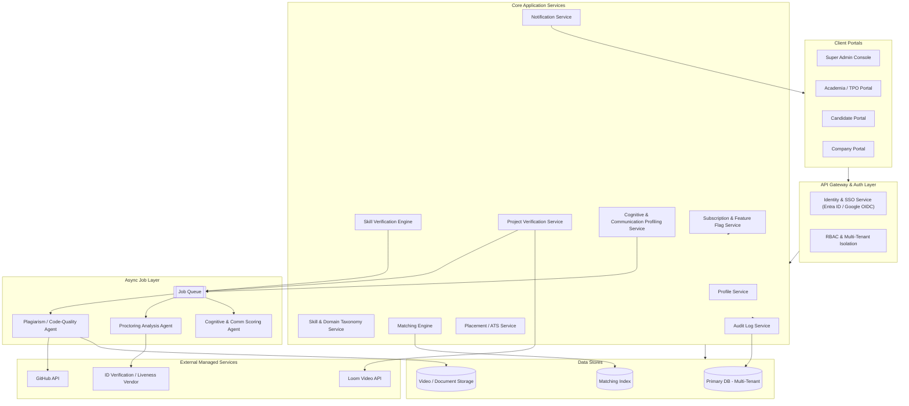
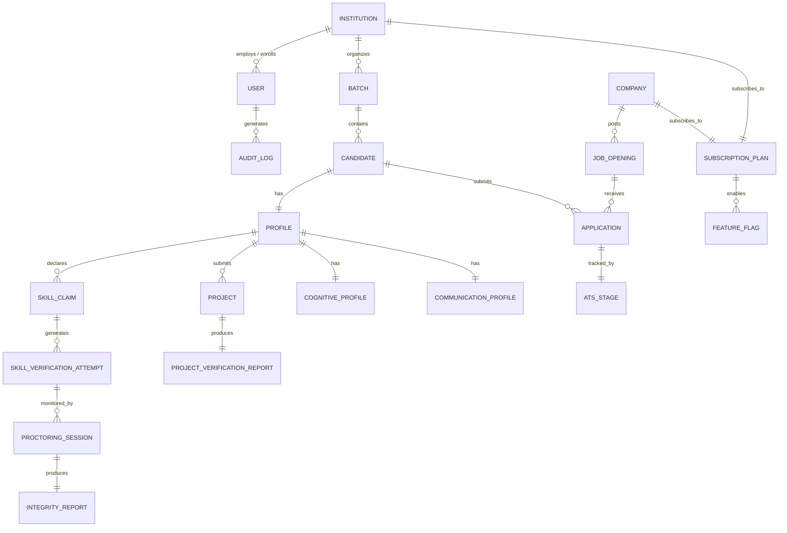
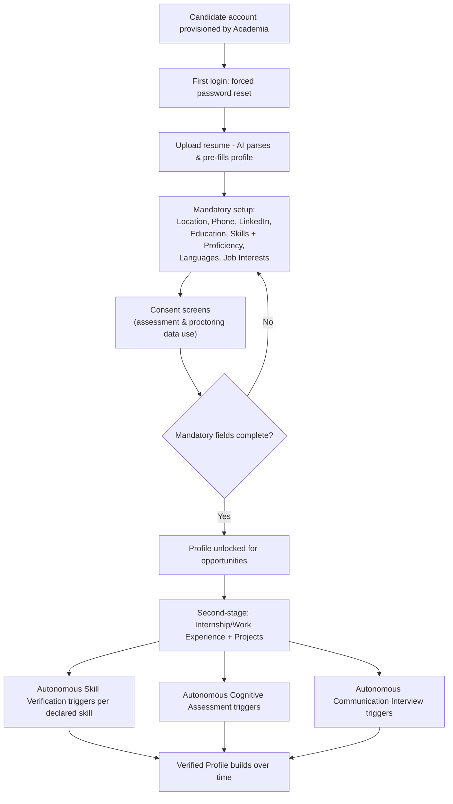
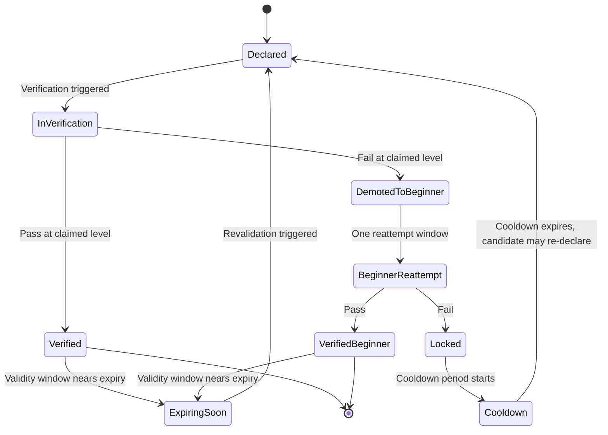
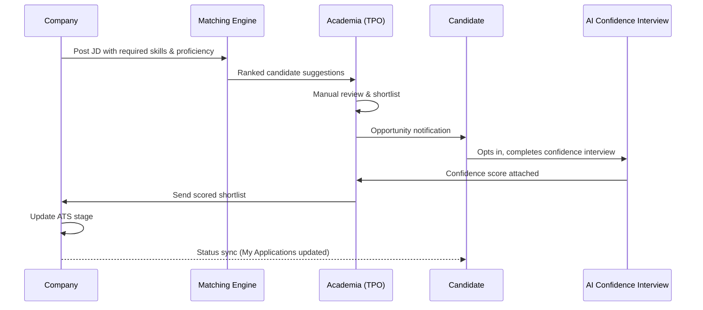
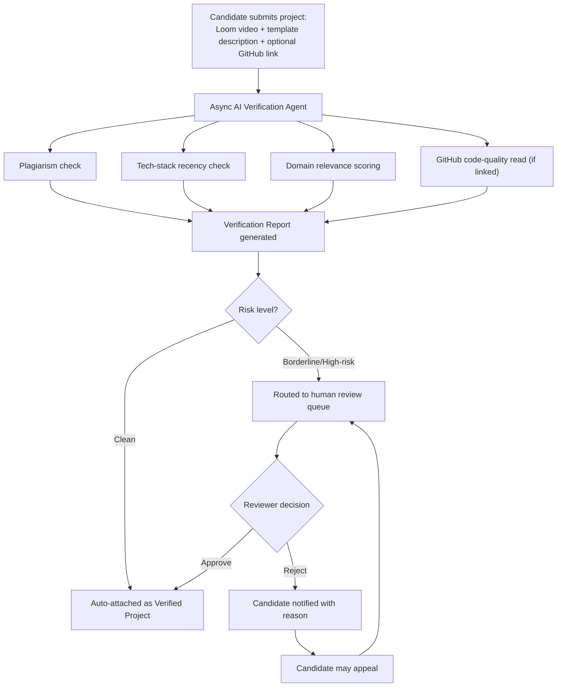
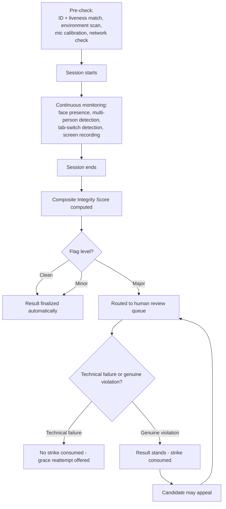
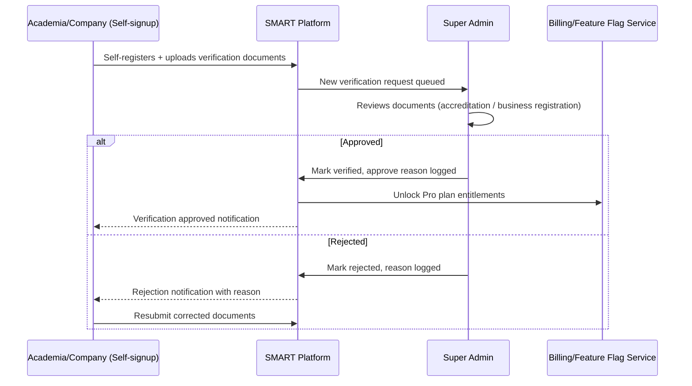

# SMART — Product Requirements Document

### AI-Powered Talent Intelligence Platform | Version 1.0 (Minimum Marketable Product)

| Field          | Detail                                            |
| -------------- | ------------------------------------------------- |
| Document Owner | Product/Technical Team                            |
| Status         | Draft for Engineering & Agency Review             |
| Date           | 28 Aug 2026                                       |
| Scope          | V1 (MMP) build, with V2/V3 roadmap flagged inline |
| Initial Domain | Engineering → Software & IT (expandable)          |

---

## 0. How to Read This Document

Every feature is tagged with a priority so scope stays honest to an MMP:

- **[M]** Must-have — cannot ship V1 without it
- **[S]** Should-have — strongly improves V1 but can slip one sprint
- **[V2]** Deferred to Phase 2
- **[V3]** Deferred to Phase 3 / longer-term roadmap

Feature IDs use module prefixes: `SA-` Super Admin, `AC-` Academia/TPO, `CN-` Candidate, `CO-` Company, `SE-` Shared Engine (cross-cutting AI/matching/proctoring systems used by multiple modules).

---

## 1. Executive Summary

SMART is an AI-powered Talent Intelligence Platform that partners directly with academic institutions to build **verified** skill profiles for students, and connects that verified talent to companies through a controlled matching layer.

The core differentiation, stated plainly:

> **SMART does not hand over a searchable data repository.** It verifies capability through autonomous, evidence-based assessment (skills, cognitive ability, communication, projects), and it closes the loop by telling the candidate exactly what to fix and giving them a path to re-verify. Companies get curated, verified profiles — not a resume database to mine.

This is the wedge against "Superset"-style platforms, which primarily aggregate and expose raw candidate data. SMART's product bet is that **verification + a continuous development loop** is what makes a profile trustworthy enough for a company to skip its own screening.

**Phase 1 (this PRD) objective:** prove the verified-profile engine works, onboard academia at scale, and connect companies through a semi-manual, TPO-mediated placement flow — deliberately lightweight on the company side. Automation of matching, self-serve company tooling, and candidate-facing job discovery are Phase 2+.

---

## 2. Goals & Success Metrics (V1)

| Goal                                       | Metric                                                             | V1 Target Direction                                                 |
| ------------------------------------------ | ------------------------------------------------------------------ | ------------------------------------------------------------------- |
| Verified profiles are real, not decorative | % of onboarded candidates with ≥1 fully verified skill             | Track weekly cohort completion                                      |
| Verification loop actually develops talent | % of "Locked" skills that get re-verified after cooldown           | Track re-attempt conversion                                         |
| Academia sees clear value fast             | TPO weekly active usage; time from JD upload → shortlist sent      | Time-to-shortlist ↓ over time                                       |
| Proctoring/verification is trustworthy     | Integrity Score distribution; false-positive appeal rate           | Appeal overturn rate should stay low but non-zero (proves fairness) |
| Company side proves "ease of hiring"       | Company NPS / time spent per hire vs. traditional resume screening | Qualitative + time-saved metric                                     |
| No data-repo leakage                       | Zero bulk-export or scraping incidents                             | Hard security requirement, not a KPI to trend                       |

---

## 3. User Roles & Permission Matrix

| Capability                          | Super Admin              | Academia (TPO)            | Candidate           | Company                                       |
| ----------------------------------- | ------------------------ | ------------------------- | ------------------- | --------------------------------------------- |
| Manage institution/company accounts | ✅ Full CRUD             | ❌                        | ❌                  | ❌                                            |
| View any candidate profile          | ✅ (brief, audit-logged) | ✅ (own institution only) | ✅ (own only, full) | ✅ (only profiles shared into their pipeline) |
| Configure pricing/feature flags     | ✅                       | ❌                        | ❌                  | ❌                                            |
| Provision candidate accounts        | ✅ (support-only)        | ✅ Primary owner          | ❌                  | ❌                                            |
| Post job/JD                         | ❌                       | ❌ (relays only)          | ❌                  | ✅                                            |
| Shortlist candidates for a JD       | ❌                       | ✅ Primary                | ❌ (opts in/out)    | ✅ (secondary, from TPO-curated list)         |
| Take assessments/interviews         | ❌                       | ❌                        | ✅                  | ❌                                            |
| Bulk export candidate data          | 🚫 Nobody — by design    | 🚫                        | 🚫                  | 🚫                                            |

The last row is the product's core trust boundary and should be enforced at the API/authorization layer, not just hidden in the UI — a determined company user must not be able to script their way to a bulk export.

---

## 4. System Architecture Principles (before diving into modules)

1. **Multi-tenant by design.** Academia and Companies are separate tenant types, each with isolated data scoping, but sharing the same underlying candidate identity and skill taxonomy graph.
2. **No bulk data egress.** All candidate data surfaces through curated, rate-limited, profile-card style APIs/views. No CSV export of candidate PII to Company tenants in V1. Academia gets aggregate/cohort exports (their own students only), never raw contact-detail dumps to third parties.
3. **Async-first for AI-heavy work.** Plagiarism checks, code-quality agent runs, video/proctoring analysis, and cognitive/communication scoring are queue-based background jobs with webhook/status-poll patterns — never synchronous request/response. Exam-day traffic spikes should not be able to take down the assessment engine.
4. **Everything sensitive is audit-logged.** Every Super Admin view of a candidate profile, every proctoring override, every manual verification decision — logged with actor, reason code, and timestamp. This is both a security requirement and a trust-building feature for candidates/institutions.
5. **Build the score infrastructure once, expose tiers later.** Skill verification %, cognitive/communication scores, and project quality scores should be modeled so that a future Gold/Silver/Bronze readiness tier (from the ORION vision) can be computed without re-architecting — even though tiering itself is V2+.
6. **India-context compliance by default.** Candidate PII, resume data, and — critically — biometric-adjacent proctoring data (face liveness, voice) fall under India's DPDP Act 2023. Explicit consent screens, data minimization, and defined retention windows are non-negotiable, not a later add-on.

---

## 5. Module: Super Admin

| ID    | Feature                                              | Description                                                                                  | Priority | Technical Notes / Fixes                                                                                                                                                                                                                                                                  |
| ----- | ---------------------------------------------------- | -------------------------------------------------------------------------------------------- | -------- | ---------------------------------------------------------------------------------------------------------------------------------------------------------------------------------------------------------------------------------------------------------------------------------------- |
| SA-01 | Academia CRUD                                        | Create/read/update/deactivate institution accounts                                           | M        | Soft-delete only; deactivation must cascade-lock student login, not delete data                                                                                                                                                                                                          |
| SA-02 | Academia SSO                                         | Sign-in via institutional Microsoft accounts                                                 | M        | Use **Microsoft Entra ID (Azure AD) OIDC**, multi-tenant app registration, admin-consent flow per institution, domain-verified auto-provisioning. Not plain "Outlook" consumer login.                                                                                                    |
| SA-03 | Company CRUD                                         | Create/read/update/deactivate company accounts                                               | M        | Same soft-delete pattern as SA-01                                                                                                                                                                                                                                                        |
| SA-04 | Company SSO                                          | Google Workspace + Microsoft OIDC                                                            | M        | SAML/Okta for large enterprise companies → **[V2]**, flagged now so auth layer is built pluggable from day one                                                                                                                                                                           |
| SA-05 | Pricing plan repo & feature entitlements             | Define plans (Free/Basic/Pro), toggle features per tenant                                    | M        | Build as a **feature-flag service keyed to subscription tier**, not hardcoded if/else in app code — this is the #1 thing that gets expensive to retrofit later                                                                                                                           |
| SA-06 | Infra & security monitoring                          | Server health, uptime, error rates, security alerts                                          | M        | Standard observability stack (metrics/logs/traces + alerting); WAF + intrusion alerts surfaced here, not built from scratch                                                                                                                                                              |
| SA-07 | Candidate profile view (brief)                       | Read-only summary view of any candidate                                                      | M        | **Must be audit-logged with a mandatory reason code** — this is PII access and needs to survive a privacy audit                                                                                                                                                                          |
| SA-08 | Map Academia → Domain                                | e.g., Engineering → Software & IT                                                            | M        | Domain taxonomy must be a managed, versioned tree — not free text — since skill pools and assessment content hang off it                                                                                                                                                                 |
| SA-09 | Map Company → Domain, Sector, Mode, other attributes | Domain (Software/IT), Sector (EdTech, Healthtech...), Mode (Service/Product), size, location | M        | Same taxonomy service as SA-08; sector/mode become filters for the matching engine later                                                                                                                                                                                                 |
| SA-10 | Academia self-onboarding verification                | Manual review of self-signup → unlocks Pro plan                                              | M        | Document upload (accreditation proof) → review queue → approve/reject with reason → notify. This is a **queue/workflow object**, not a boolean flag.                                                                                                                                     |
| SA-11 | Company self-onboarding verification                 | Manual review of self-signup → unlocks Pro plan                                              | M        | _(Corrected from spec — this unlocks Pro for the Company, not Academia.)_ Verify via business registration/GSTIN + domain/website + LinkedIn presence check                                                                                                                              |
| SA-12 | Skill & Assessment Taxonomy management               | Curate skill pools, proficiency rubrics, question banks per domain                           | M        | **Missing from the original list but structurally required** — candidates are promised "a pool of skills relevant to domain" (Candidate #6) and someone has to own that content. Fold into Super Admin for V1; consider a dedicated "Content Admin" role in V2 once volume justifies it. |
| SA-13 | Internal team RBAC                                   | Multiple internal admin users with scoped permissions (support vs. finance vs. security)     | S        | A single "Super Admin" account for an entire company is itself a security risk                                                                                                                                                                                                           |
| SA-14 | Support impersonation / assisted login               | View-as-user for support tickets                                                             | S        | Must be time-boxed, audit-logged, and visibly flagged to the user whose session is being viewed                                                                                                                                                                                          |

---

## 6. Module: Academia (TPO)

### 6.1 Dashboard — Card Ideas

| Card                               | What it shows                                                                                | Why it matters                                                                                                                           |
| ---------------------------------- | -------------------------------------------------------------------------------------------- | ---------------------------------------------------------------------------------------------------------------------------------------- |
| Profile Completion Funnel          | % students: registered → profile complete → ≥1 skill verified                                | Surfaces onboarding drop-off immediately                                                                                                 |
| Skill Verification Snapshot        | Count of Verified (Beginner/Intermediate/Advanced) vs. In Progress vs. Locked, across cohort | Direct evidence of "capability actually built" — the doc's own core pitch to institutions                                                |
| Active Placement Pipeline          | JDs received → Shortlisted → AI-Verified → Sent to company, as a funnel                      | TPO's day-to-day operational view                                                                                                        |
| Pending AI-Verification Interviews | Candidates who opted into an opportunity but haven't completed their confidence-check yet    | Action queue, not just a metric                                                                                                          |
| Top Skill Gaps (Cohort)            | Aggregated weak areas across the batch                                                       | Feeds directly into what Drills/training the institution should run                                                                      |
| Company Engagement                 | # companies actively sourcing from this institution, JD volume trend                         | Institution-facing proof of ROI                                                                                                          |
| Batch-wise Readiness               | Verified-skill density by batch/department                                                   | Lets TPO prioritize which batch needs intervention first                                                                                 |
| Upcoming Assessment/Interview Load | Scheduled system-driven verifications this week                                              | Capacity/communication planning                                                                                                          |
| Compliance Export Ready            | One-click placement-data export                                                              | India-specific: NAAC/NBA accreditation cycles require placement evidence — worth surfacing as a differentiator, not just a report button |

### 6.2 Feature List

| ID    | Feature                                                            | Priority | Notes                                                                                                                                                                                                 |
| ----- | ------------------------------------------------------------------ | -------- | ----------------------------------------------------------------------------------------------------------------------------------------------------------------------------------------------------- |
| AC-01 | Dashboard (above cards)                                            | M        | —                                                                                                                                                                                                     |
| AC-02 | Candidate access provisioning                                      | M        | Bulk CSV/Excel upload, auto-credential generation, email invite. SIS/ERP integration → **[V2]**                                                                                                       |
| AC-03 | Placement management (JD → shortlist → opportunity → verification) | M        | See 6.3 for the full flow — this is the highest-complexity Academia feature                                                                                                                           |
| AC-04 | Batch management                                                   | M        | CRUD batches, assign domain/department, map students, batch-level analytics roll-up                                                                                                                   |
| AC-05 | Bulk communication center                                          | S        | Notify a batch/cohort about upcoming drives, verification deadlines                                                                                                                                   |
| AC-06 | Multiple TPO staff seats with scoped permissions                   | S        | One institution ≠ one person; placement cells have teams                                                                                                                                              |
| AC-07 | Assessment builder (supplementary, drive-specific)                 | V2       | **Scope correction:** this does _not_ replace the autonomous skill-verification engine candidates go through (Candidate #8–10). It lets a TPO add a _drive-specific_ extra round for a particular JD. |
| AC-08 | Interview builder (supplementary, drive-specific)                  | V2       | Same relationship as AC-07 — parameters for a company-specific round, layered on top of the always-on verification engine                                                                             |
| AC-09 | Compliance/accreditation export (NAAC/NBA-style reports)           | S        | Not in your original list; recommended addition — Indian institutions need placement evidence for accreditation, and this makes SMART indispensable to the TPO office specifically                    |

### 6.3 Placement Management — Detailed Flow

```
Company posts JD
      ↓
Matching Engine (V1: rules-based ranking) suggests candidates to TPO
      ↓
TPO reviews ranked list, manually shortlists
      ↓
Shortlisted candidates see it as an "Opportunity" in their portal
      ↓
Candidate opts in → triggers a lightweight AI Confidence Interview
      (short, structured, async video Q&A — distinct from the full
       Interview Builder module, which is a heavier V2 capability)
      ↓
Confidence Score attached to candidate's shortlist entry
      ↓
TPO reviews scored shortlist → sends final list to Company
      ↓
Company ATS receives candidates at "New Matches" stage
      ↓
Company updates ATS stage → reflected back on candidate's
      "My Applications" status in real time
```

**Flaw fixed:** running a _full_ interview for every shortlisted candidate on every JD doesn't scale and duplicates the skill-verification interview candidates already sat through. V1 uses a short, purpose-built "confidence check" (5–10 min, structured, auto-scored) specifically to validate _fit for this opportunity_, not to re-verify skills from scratch.

---

## 7. Module: Candidate

This is the highest-complexity module — it's where the "verify, don't just collect" promise lives.

### 7.1 Onboarding Flow (First Login)

```
1. Forced password reset
2. Upload resume → AI parses & pre-fills profile fields
3. Mandatory setup: Location, Phone, LinkedIn, Education,
   Skills (from domain-specific pool, self-declared proficiency:
   Beginner / Intermediate / Advanced), Languages (Native + Second,
   with fluency level), Job Interests
4. Consent screens for assessment/proctoring data use (DPDP compliance)
      ↓
5. Gate: cannot apply to opportunities until Step 3 is complete
      ↓
6. Second-stage completion: Internship & Work Experience, Projects
      ↓
7. Autonomous Skill Verification triggers per declared skill
8. Autonomous Cognitive Assessment + Communication Interview triggers
   independently of any specific skill claim
```

### 7.2 Core Feature List

| ID    | Feature                                                             | Priority | Notes                                                                                                                                                                                            |
| ----- | ------------------------------------------------------------------- | -------- | ------------------------------------------------------------------------------------------------------------------------------------------------------------------------------------------------ |
| CN-01 | My Applications (status tracking)                                   | M        | Status updates flow in from Company ATS stage changes                                                                                                                                            |
| CN-02 | Jobs feed matched to profile                                        | V2       | V1 candidates only see opportunities TPO explicitly shortlists them for — no self-serve browse yet, consistent with the "manual" phase-1 positioning                                             |
| CN-03 | Assessments inbox                                                   | M        | Upcoming/system-scheduled assessments                                                                                                                                                            |
| CN-04 | Interviews inbox                                                    | M        | Upcoming AI-driven verification interviews                                                                                                                                                       |
| CN-05 | Profile (Basic, Education, Experience, Skills, Projects, Languages) | M        | —                                                                                                                                                                                                |
| CN-06 | Guided first-login onboarding                                       | M        | See 7.1                                                                                                                                                                                          |
| CN-07 | Autonomous Skill Verification Engine                                | M        | See 7.3 — the core trust mechanism of the product                                                                                                                                                |
| CN-08 | Project Verification pipeline (Loom + template + AI checks)         | M        | See 7.4                                                                                                                                                                                          |
| CN-09 | Autonomous Cognitive & Communication Profiling                      | M        | See 7.5                                                                                                                                                                                          |
| CN-10 | Publicly shareable verified profile                                 | M        | See 7.6                                                                                                                                                                                          |
| CN-11 | Skill revalidation / decay nudges                                   | S        | **Recommended addition** — see 7.3, closes the "continuous" part of the stated objective, which the original spec only half-covers                                                               |
| CN-12 | Appeal / manual review request                                      | S        | **Recommended addition** — candidate-facing counterpart to the proctoring/plagiarism human-review flow in Section 9.3; without this, a false-positive flag is unappealable and erodes trust fast |

### 7.3 Skill Verification Engine — Formalized State Machine

Your spec implies a retry/lockout system without pinning down the exact transitions. Here's the formalized version, built to be fair, explainable, and simple to implement as a state machine rather than ad hoc logic:

| Claimed Level           | Verification Requirement                             | Pass Threshold                                             |
| ----------------------- | ---------------------------------------------------- | ---------------------------------------------------------- |
| Beginner                | Assessment only                                      | Configurable, e.g. ≥60%                                    |
| Intermediate / Advanced | Assessment **+** AI Interview (weighted, e.g. 40/60) | Configurable per skill, both components must clear a floor |

**Transition rules (2-strike model with cooldown):**

1. **Attempt 1** at the claimed level.
   - Pass → Skill marked **Verified** at that level, with a validity window (see CN-11).
   - Fail → Candidate is **demoted to Beginner track** for that skill (their claim isn't discarded, but the bar drops).
2. **Attempt 2 (the "one reattempt")** — at Beginner level.
   - Pass → Skill marked **Verified: Beginner**. Candidate can re-attempt a higher level again only after the standard cooldown, to prevent immediate re-claiming without genuine growth.
   - Fail → Skill is **Locked**.
3. **Locked state** → skill enters a **cooldown period** (configurable per skill type, e.g. 60–90 days) during which it cannot be re-attempted or re-claimed.
4. **Post-cooldown** → candidate may re-declare the skill and re-enter Attempt 1, fresh.

Every transition triggers a transparent, plain-language notification ("You moved to the Beginner track because…") — candidates should never be confused about _why_ their status changed. A **flagged-as-technical-failure** attempt (proctoring/connectivity issue, not a genuine fail) should not consume a strike — this requires the proctoring system (Section 9.3) to distinguish integrity violations from technical glitches.

**Recommended addition (CN-11) — Skill Decay:** a Verified badge should carry a "Valid until" date (e.g., 6–12 months for fast-moving tech skills), with proactive re-verification nudges before expiry. Without this, "verified" becomes a permanent, stale label — which undercuts the platform's own "continuously assess" objective.

### 7.4 Project Verification Pipeline

```
Candidate submits: Loom video walkthrough + structured description
      (template-driven: problem, approach, stack, outcome)
      + optional GitHub link
                    ↓
        AI Verification Agent runs (async job):
   • Plagiarism check (vs. public repos & prior submissions)
   • Tech-stack recency / "tech age" check
   • Domain/industry relevance scoring
   • If GitHub linked: code-quality agent reads the repo
     (structure, commit history authenticity, code quality signals)
                    ↓
        Output: Verification Report
   (score + specific flags, not just pass/fail)
                    ↓
   Clean → auto-attached to profile as "Verified Project"
   Borderline/High-risk flag → routed to human review queue
   (never an automatic reject — see CN-12 Appeal)
```

**Flaw fixed:** fully automated plagiarism/authenticity scoring on creative technical work has a real false-positive risk (e.g., legitimate use of common boilerplate flagged as copied). Borderline and high-risk results route to a human reviewer before anything punitive happens to the candidate's profile — automation drives triage, not final judgment.

### 7.5 Cognitive & Communication Profiling

- Runs **autonomously**, independent of any specific skill claim — this is about understanding the _person_, not grading a skill.
- Outputs a strengths/weaknesses narrative, not just a number.
- **Refreshes periodically** (recommend every 3–6 months, or on-demand shortly before an active placement drive) to stay current.
- Feeds into the AI Confidence Interview (Section 6.3) as contextual signal, and later into the ORION-style Gold/Silver/Bronze tiering (V2+).

### 7.6 Public Shareable Profile

- Unique URL; candidate controls visibility toggles per section.
- Shows: verified skills with level + verification date, cognitive/communication snapshot, verified projects with embedded Loom video.
- **No bulk-scrapeable data** — rendered as a profile page, not an API-exposed dataset, consistent with the platform's core "no shared data repo" principle.
- Contact details opt-in only (default hidden) to prevent this becoming a spam vector.

---

## 8. Module: Company (Deliberately Lightweight — V1)

Phase 1's job on the company side is to _prove_ quality and ease, not to replace an enterprise ATS. Scope accordingly.

| ID    | Feature                                 | Priority | Notes                                                                                                                                                                                                         |
| ----- | --------------------------------------- | -------- | ------------------------------------------------------------------------------------------------------------------------------------------------------------------------------------------------------------- |
| CO-01 | My Openings — JD creation               | M        | Rich fields: domain, required skills **with minimum proficiency level**, experience range, location/remote, employment type, headcount — the more structured this is, the better the matching engine performs |
| CO-02 | ATS — Kanban view                       | M        | Columns: New Matches → Shortlisted → AI-Verified → Interviewing → Offer → Hired → Rejected                                                                                                                    |
| CO-03 | Candidate profile card view             | M        | Verified badges, cognitive/comm summary, verified projects — **no raw resume dump, no bulk export**                                                                                                           |
| CO-04 | Filters within ATS                      | S        | By skill, proficiency, confidence score, institution, location                                                                                                                                                |
| CO-05 | Stage-change → candidate status sync    | M        | Closes the loop with CN-01 (candidate sees status update automatically)                                                                                                                                       |
| CO-06 | Single-seat company account             | M (V1)   | Multi-seat/team accounts → **[V2]** — keep V1 minimal per your instruction                                                                                                                                    |
| CO-07 | Self-serve job matching / auto-sourcing | V2/V3    | V1 sourcing is TPO-mediated by design (see Section 6.3)                                                                                                                                                       |

---

## 9. Cross-Cutting Engines

### 9.1 Matching Algorithm

- **V1:** Rules-based, transparent scoring — weighted sum of (required skill presence & proficiency met/exceeded) + domain match + experience relevance + location fit. Produces a _ranked suggestion list_ surfaced to the TPO, who makes the final human call. This is intentional: it matches your "connects companies almost manually" phase-1 strategy and avoids over-promising an AI-matching capability before there's enough verified-data volume to trust it.
- **V2/V3 (ORION-aligned):** fully autonomous matching, continuous market-demand-informed competency weighting, direct candidate-facing job feed, feeding into readiness tiers.

### 9.2 Skill Verification Methodology

Covered in depth in 7.3. Key design principle: **thresholds and cooldown periods must be configurable per skill/domain**, not hardcoded — different skills (e.g., a fast-moving framework vs. a stable fundamental) warrant different revalidation cadences.

### 9.3 Proctoring & Integrity System

| Stage     | Checks                                                                                                                                                                                                  |
| --------- | ------------------------------------------------------------------------------------------------------------------------------------------------------------------------------------------------------- |
| Pre-check | ID document + liveness selfie match; environment/lighting scan; mic calibration (read-aloud test); network bandwidth check; browser lockdown/kiosk mode                                                 |
| During    | Continuous face presence & gaze tracking; multiple-person detection; tab-switch/window-blur detection; screen recording; audio anomaly detection (extra voices); copy-paste blocking on technical tests |
| Post      | Composite **Integrity Score**; severity-weighted violation flags: Clean / Minor / Major                                                                                                                 |
| Review    | Major flags → mandatory human review before result finalization; candidate can appeal (CN-12)                                                                                                           |

**Flaw fixed — fairness:** connectivity drops or device issues must be classified separately from intentional violations. A candidate shouldn't burn a verification "strike" (Section 7.3) because their webcam froze. This requires the proctoring engine to log a distinct "technical interruption" event type, separate from "integrity violation."

**Accessibility note:** candidates with disabilities may need proctoring accommodations (e.g., alternate identity verification, adjusted gaze-tracking sensitivity) — flag for policy definition before launch, not as an afterthought.

---

## 10. Non-Functional Requirements

- **Privacy/Compliance:** DPDP Act 2023 alignment — explicit consent for biometric-adjacent data (face/voice), data minimization, defined retention windows, right-to-erasure support.
- **Security:** encryption in transit and at rest; RBAC enforced at the API layer; full audit trail for PII access (SA-07) and admin actions.
- **Performance/Reliability:** assessment/proctoring infrastructure must handle exam-day concurrency spikes without degrading; async job architecture (Section 4, principle 3) is the primary mitigation.
- **Browser/Device support:** current two major versions of Chrome/Edge; documented minimum bandwidth and webcam/mic requirements published to candidates in advance.
- **Accessibility:** WCAG 2.1 AA target where feasible, with defined proctoring accommodations (see 9.3).

---

## 11. Key Data Entities (High-Level)

`User` · `Role` · `Institution` · `Company` · `DomainTaxonomy` · `Skill` · `SkillVerificationAttempt` · `Assessment` · `Interview` · `Project` · `ProjectVerificationReport` · `CognitiveProfile` · `CommunicationProfile` · `Opportunity/JD` · `Application` · `ATSStage` · `ProctoringSession` · `IntegrityReport` · `SubscriptionPlan` · `FeatureFlag` · `AuditLog`

---

## 12. Risks & Mitigations

| Risk                                                   | Mitigation                                                                                                         |
| ------------------------------------------------------ | ------------------------------------------------------------------------------------------------------------------ |
| AI false positives (plagiarism/proctoring) erode trust | Human-review escalation + candidate appeal flow (CN-12) — never fully automated punitive action                    |
| Low company engagement without automation              | Concierge-style TPO-mediated matching + sales-assisted onboarding in V1; automation lands once volume justifies it |
| Skill taxonomy goes stale                              | Governance cadence tied to ORION-style expert review, owned by SA-12                                               |
| Proctoring/video infra cost at scale                   | Prefer managed vendors (liveness/ID verification APIs, Loom for project video) over building in-house for V1       |
| Biometric data privacy backlash                        | Explicit consent, minimization, DPDP-aligned retention limits                                                      |

## 13. Open Questions

- Who authors skill/assessment content long-term — internal ORION team or contracted SMEs?
- Final pricing tier structure (per-seat vs. per-institution) — pending finalization against the commercial model doc.
- Exact cooldown durations per skill category — needs input from assessment content owners, not just engineering defaults.

---

## 14. Roadmap Summary

| Phase        | Scope                                                                                                                                                                                                                                                                        |
| ------------ | ---------------------------------------------------------------------------------------------------------------------------------------------------------------------------------------------------------------------------------------------------------------------------- |
| **V1 (MMP)** | Verified Profile engine (skills, projects, cognitive/comm), proctoring, public profile; Academia dashboard + manual placement flow with AI confidence check; lightweight Company JD + Kanban ATS; Super Admin core (CRUD, SSO, verification workflows, taxonomy, monitoring) |
| **V2**       | TPO Assessment/Interview builders (supplementary rounds); autonomous job matching + candidate job feed; multi-seat company accounts; enterprise SAML SSO; NAAC/NBA compliance exports; skill revalidation automation; Gold/Silver/Bronze readiness tiers                     |
| **V3**       | Full ORION-driven marketplace; placement-outcome intelligence feedback loop; domain expansion beyond Engineering; industry expert-panel portal; advanced cross-institution benchmarking                                                                                      |

---

## 15. Glossary

- **TPO** — Training & Placement Officer (Academia's primary user)
- **JD** — Job Description
- **ATS** — Applicant Tracking System
- **MMP** — Minimum Marketable Product
- **Confidence Score** — output of the lightweight AI interview run per shortlisted opportunity
- **Integrity Score** — composite proctoring trust score for an assessment/interview session
- **Skill Cooldown** — mandatory waiting period before a locked skill can be re-attempted
- **ORION** — the market/role-intelligence layer that informs SMART's competency framework and (in later phases) drives autonomous matching and readiness tiering

---

## 16. Appendix: Architecture & Process Diagrams

These diagrams are provided as standalone `.mermaid` files alongside this document for direct rendering, and reproduced here as source so this PRD stays a single, portable reference. Paste any block into Mermaid Live Editor, GitHub, Notion, or Confluence to render it there as well.

### 16.1 High-Level System Architecture



### 16.2 Data Model (Entity Relationship)



### 16.3 Candidate Onboarding Flow



### 16.4 Skill Verification State Machine



### 16.5 Placement Management Sequence



### 16.6 Project Verification Pipeline



### 16.7 Proctoring & Integrity Flow



### 16.8 Academia / Company Self-Onboarding Verification Sequence


